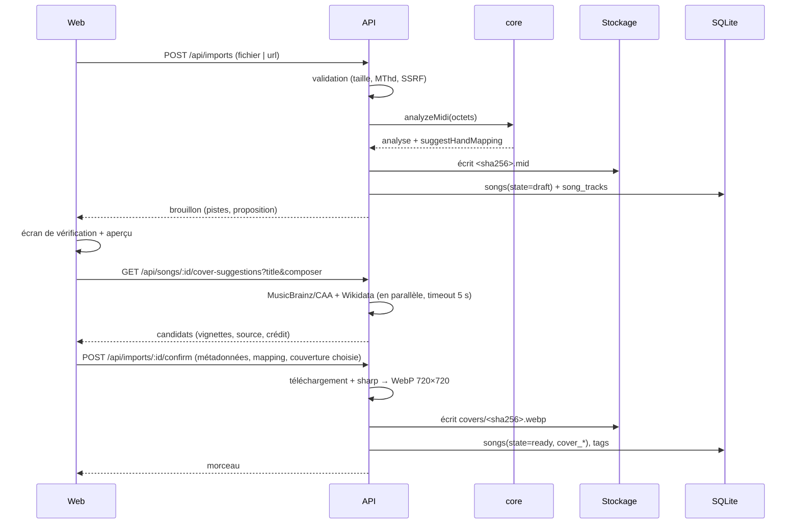
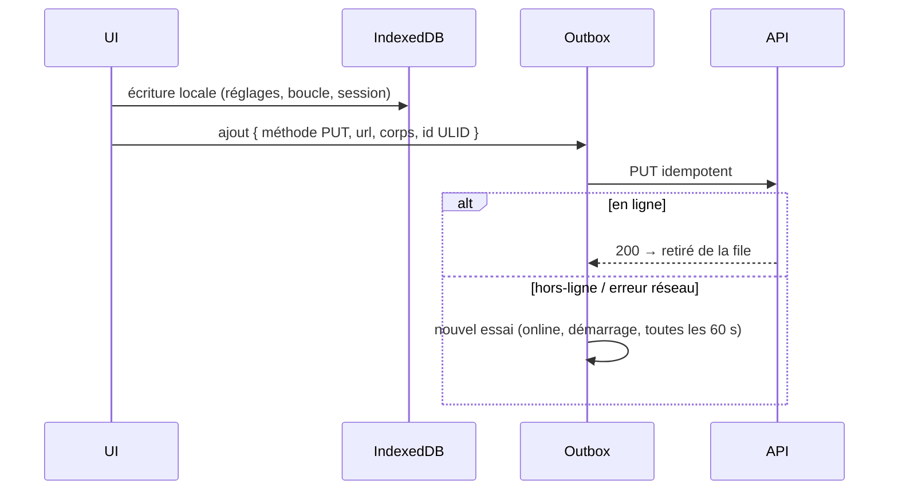

# Open Keys — Architecture : Flux principaux

[← Sommaire](./README.md)

## Import

```mermaid
sequenceDiagram
  participant W as Web
  participant A as API
  participant C as core
  participant F as Stockage
  participant D as SQLite
  W->>A: POST /api/imports (fichier | url)
  A->>A: validation (taille, MThd, SSRF)
  A->>C: analyzeMidi(octets)
  C-->>A: analyse + suggestHandMapping
  A->>F: écrit <sha256>.mid
  A->>D: songs(state=draft) + song_tracks
  A-->>W: brouillon (pistes, proposition)
  W->>W: écran de vérification + aperçu
  W->>A: GET /api/songs/:id/cover-suggestions?title&composer
  A->>A: MusicBrainz/CAA + Wikidata (en parallèle, timeout 5 s)
  A-->>W: candidats (vignettes, source, crédit)
  W->>A: POST /api/imports/:id/confirm (métadonnées, mapping, couverture choisie)
  A->>A: téléchargement + sharp → WebP 720×720
  A->>F: écrit covers/<sha256>.webp
  A->>D: songs(state=ready, cover_*), tags
  A-->>W: morceau
```

## Synchronisation hors-ligne

```mermaid
sequenceDiagram
  participant UI
  participant IDB as IndexedDB
  participant OB as Outbox
  participant A as API
  UI->>IDB: écriture locale (réglages, boucle, session)
  UI->>OB: ajout { méthode PUT, url, corps, id ULID }
  OB->>A: PUT idempotent
  alt en ligne
    A-->>OB: 200 → retiré de la file
  else hors-ligne / erreur réseau
    OB->>OB: nouvel essai (online, démarrage, toutes les 60 s)
  end
```
